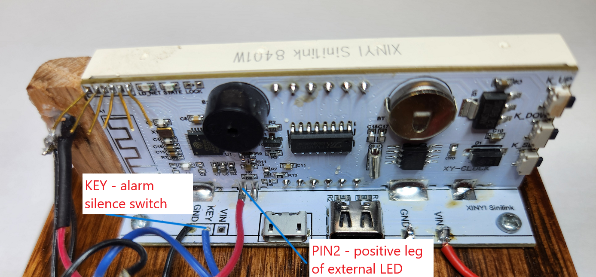

# XY-Wifi Clock Replacement Firmware

This is a replacement firmware for the XY-Clock with Wifi (and similar variants) found at https://www.aliexpress.us/item/3256804264884635.html and https://www.aliexpress.us/item/3256805364104474.html. The firmware is a fork of the EdenRidgway XY-Wifi-Clock Project.
The firmware has the following features:
* No need to install the Sinilink mobile app. Functionality is controlled via a web page served from the ESP8285 chip on the clock.
* Easy setup of connection to Wifi network using temporary access point.
* Synchronisation with a Network Time Protocol server (NTP) to get the correct time.
* Use of onboard real-time clock chip with backup battery to allow operation when Wifi is unavailable.
* A configuration web page that allows you to:
  * Change the device name, timezone and various display options
  * Change brightness based on the time of day
  * Setup up to 7 alarms (to be activated on selected days)

###  Changes from Fork of EdenRidgway XY-Wifi-Clock Project

The main change is to enable use of the DS1307 real-time clock chip.  This allows the clock to be used when a Wifi connection is unavailable.

Other changes are:
* Add long-press functionality to the UP and DOWN buttons.  Long-pressing the UP button displays the current date. Long-pressing the DOWN button displays currently enabled alarms.  Alarms that will occur later today or tomorrow blink twice.
* Use the two LEDs on the top of the clock board.  The blue LED indicates a successful connection to a Wifi network.  The red LED displays NTP connection status.  If a successful NTP time fetch has occurred, the LED will light continuously. If NTP is unavailable or has failed a periodic update, the LED will blink.
* Add an alarm buzzer.  If selected on the config page, the buzzer will sound at the alarm time.  It will turn off if the web config page is fetched by a browser.  It will also turn off if an external alarm silence switch is installed.  The silence switch is a momentary normally open pushbutton that is connected between the KEY pad on the small 90 degree daughter board and ground.  Finally, the buzzer will turn off after a 5 minute timeout.
* Add an external AM/PM LED.  The "dots" on the clock display aren't that great for displaying AM/PM, as talked about in the EdenRidgway project discussion. The rightmost dot would be ideal, but it doesn't appear to be connected on the PWB.  An external LED can be added between the PIN2 pad and ground.  The drive for the LED is one of the pulse-width modulated outputs of the ESP8285.  The duty cycle of the pulse is varied when the display brightness changes, so the external LED brightness varies.
* The number of alarms was changed from 6 to 7 so as to be able to have a unique alarm for each day of the week.
* The possible brightness levels was changed from 7 to 8.
* The web config page has more options for clock format, date format, alarm sound, auto-brightness enable and individual alarm enable.
* A new file, XY-Wifi-Clock.h was added that allows for changing various constants used in the program.  Read the comments to see what can be modified.
* 12 hour operation is fully supported in the clock and on the config page.  Previously alarms were always 24 hour based, even if the clock was set to display 12 hour time.

Using the DS1307 clock chip changes the way the clock works.  Previously, the clock had to have a Wifi connection to work.  Now it doesn't.  The clock always tries to connect to Wifi at power-up, but only for 15 seconds.  If Wifi can't connect, the clock chip time is used.  The 15 second time can be changed in the XY-Wifi-Clock.h file.  Whenever a successful NTP clock update occurs, the clock chip time is reset.  Note that a CR927 battery must be installed for the clock to maintain time without power.

One other change is to easily allow changing the Wifi connection.  If you hold the SET button down for 5 seconds during power-up, the currently saved Wifi connection is erased and the XY-Clock hotspot is activated.  Connect to the XY-Clock hotspot, then access it at 192.168.4.1 to pick a new Wifi connection.  The display will show a count-down from 5 to 1, and will then display "conn".

## Possible Future Changes

 - [ ] Add a snooze alarm function
 - [ ] Support uploading of user defined alarm sounds

## Flashing the Wifi Clock

You can use an FTDI programmer and empty pins at the top left of the board to reprogram the ESP8285. You can use breadboard jumper wires to connect it up to the FTDI programmer. Make sure you put the FTDI programmer in 3.3V mode (you will destroy the chip if the FTDI is in 5V mode). The layout of the pins on the PCB are as follows:

You need to connect the FTDI to the board in the following way:

| Pin  | Function | FTDI |
| ---- | -------- |----- |
| 1    | GND      | GND  |
| 2    | TX       | RX   |
| 3    | RX       | TX   |
| 4    | GPIO0    | GND when flashing firmware |
| 5    | CHIP_EN  | not used     |
| 6    | VCC      | VCC  |

GPIO0 must be connected to GND to put the ESP8285 into flashing mode.  You can do this before connecting the FTDI programmer to the computer or before connecting the VCC pins.  Either way, it is optional to leave it connected during the flashing process.

After the first flash and upload of Sketch Data, you can use ArduinoOTA to update it.  It may be important to always use the same board configuration as you used during the initial flash so as to keep SPIFFs intact. I recommend setting to Board: Generic ESP8266 with 2MB Flash / FS:256KB.

Once the new firmware has been uploaded, disconnect GPIO0 from GND and reset the device to run it. You can just unplug the FTDI from the USB port and plug it back in which will resupply power to the board and allow you to use the Serial Monitor to debug it.

### Hardware Interface

| GPIO   | Usage         |
| ------ | ------------- |
| GPIO0  | Blue LED      |
| GPIO2  | Red LED       |
| GPIO4  | AM/PM LED     |
| GPIO5  | Buzzer        |
| GPIO9  | DOWN Button   |
| GPIO10 | UP Button     |
| GPIO12 | I2C Clock     |
| GPIO13 | I2C Data      |
| GPIO14 | Alarm Silence |
| GPIO16 | SET Button    |

### SPIFFs

For now, this firmware requires that you add SPIFFs sketch data as a second step in the flashing process.  Use the same method as above to put the ESP into flashing mode.

You will need the ESP8266 File System Uploader plugin for arduino IDE to upload the config web page to the device.  Get it here: https://github.com/esp8266/arduino-esp8266fs-plugin.  This plugin is only compatible with Legacy Arduino IDE 1.8 (not the newer 2).

Once you have installed the plugin and restarted the IDE, open up the project and use the Tools -> ESP866 Sketch Data Upoad option to upload the data folder (including the Config.html) file.

When this project is migrated to platform.io in the future we will use this approach: https://docs.platformio.org/en/latest/platforms/espressif8266.html#uploading-files-to-filesystem so this step will just be part of the standard build and deployment process.

### Arduino Libraries Used

You will need to install support for the ESP8266 chip in the Arduino IDE as well as the following libraries in order to get the firmware to compile:
* WiFiManager by Tzapu: https://github.com/tzapu/WiFiManager
* ArduinoJson: https://github.com/bblanchon/ArduinoJson
* Adafruit_GFX by Adafruit: https://github.com/adafruit/Adafruit-GFX-Library
* TM16xx LEDs and Buttons by Maxint: https://github.com/maxint-rd/TM16xx
* Button2 by Lennart Hennigs: https://github.com/LennartHennigs/Button2

## How to Use This Firmware

* When using it for the first time it will create a Wifi access point called XY-Clock. Connect to this and select the Wifi network and enter the password. It will then connect to the Wifi Network and sync the time with the pool.ntp.org or time.nist.gov Network Time Protocol server.

* It uses the configured timezone to then display the correct time for your region. The Wifi clock will attempt to setup an mDNS entry for http://xy-clock.local or the device name you specify. While mDNS is apparently natively supported in Windows 10 build 1703 and later, if it doesn't work for you on Windows you may need to install the Apple Bonjour service ([download link](https://support.apple.com/kb/dl999)). That being said, you may have better success using the IP address of the clock.

* The config page looks like the screenshot below. The focus at the moment is functionality rather than looks, but at some point this needs to have better styling applied to it.

The buttons can be used as such:
| Button  | Short-press Function        | Long-press Function (hold for 2 seconds) |
| ------- | --------------------------- |----------------------------------------- |
| Up      | Increase Brightness         | Display Date                             |
| Down    | Decrease Brightness         | Display Alarms                           |
| Set     | Show the Clock's IP Address | Turn on/off the hotspot                  |

###  Function Notes

Changing the brightness using the buttons is temporary and will reset whenever the auto-brightness is changed by the Day Start or Night Start times.  However the auto-brightness can be disabled via the checkbox on the config page.

The hotspot will be created using the device name from the configuration page.  The configuration page can then be accessed through http://192.168.4.1 (which is an ESP device's default).  The hotspot will be automatically turned off after 5 minutes.

There some quirks and known issues with ESP devices, especially when accessing the hotspot on certain Android phones.   First, it may not correctly load the clock's configuration if the mobile device still has data mode on.  So, try turning off mobile data when loading the webpage.  Second, it appears that Chrome mobile may work better - if there is an error, you can simply pull down to refresh the page (unlike some other mobile browsers).  Finally, it's important to know that changing the time zone or device name WILL reset the device, turning off the hotspot, so you may need to repeat turning on and connecting to the hotspot after changing timezones.

## Thanks
This work is built on top investigations and information that others have gathered. In particular I want to thank:
* Eden Ridgway for the original firmware this fork is based on.
* Stefan Oskamp (@stefan-oskamp) for working out the GPIO connections on the board
* @sfromis, @MacSass and others who contributed to the discussion on https://github.com/arendst/Tasmota/discussions/15788
